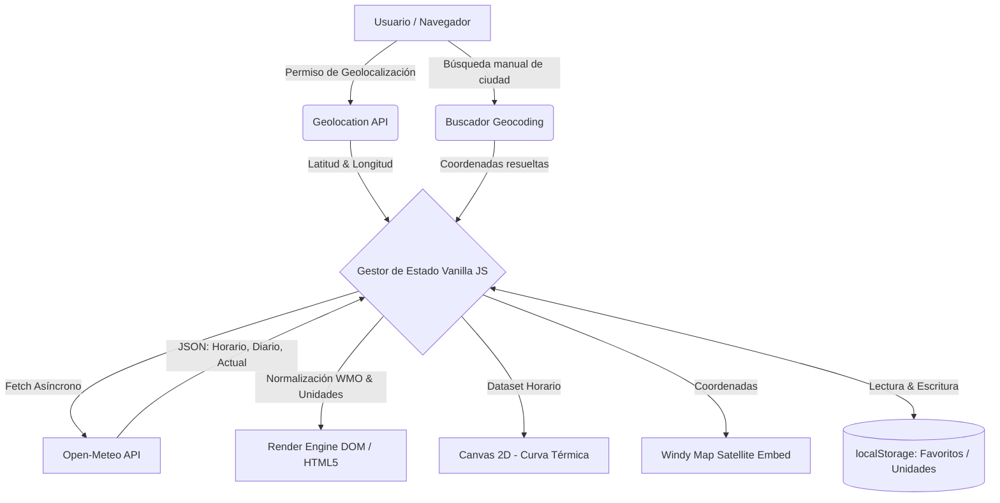

# 🌦️ ATMOS. — Hyperlocal Weather Dashboard & PWA

<div align="center">

### **Predicción meteorológica en tiempo real, telemetría ambiental y radar interactivo.**

[](https://roberttedt-jr.github.io/atmos/app.html)
[](https://developer.mozilla.org/es/docs/Web/JavaScript)
[](https://open-meteo.com/)
[](https://windy.com/)
[](https://web.dev/progressive-web-apps/)
[](LICENSE)

**🌐 Aplicación en Producción:** [https://roberttedt-jr.github.io/atmos/app.html](https://roberttedt-jr.github.io/atmos/app.html)

[Características](#-características-principales) • [Arquitectura & Flujo de Datos](#-arquitectura-y-flujo-de-datos) • [Stack Tecnológico](#-stack-tecnológico) • [Estructura](#-estructura-del-proyecto) • [Instalación y Uso Local](#-instalación-y-ejecución-local)

</div>

---

## 📖 Descripción del Proyecto

**ATMOS.** es una Progressive Web App (PWA) de meteorología en tiempo real concebida bajo una filosofía *zero-bloatware* (Vanilla JavaScript ES6+ sin frameworks pesados). Ofrece predicciones hiperlocales, telemetría ambiental exhaustiva (AQI, índice UV, punto de rocío, visibilidad), pronósticos horarios graficados dinámicamente sobre `<canvas>` y visualizaciones cartográficas satelitales en vivo.

Al prescindir de empaquetadores complejos o virtual DOM, ATMOS. garantiza tiempos de carga casi instantáneos (**LCP < 1.2s**) y un consumo mínimo de batería y datos móviles.

---

## ✨ Características Principales

- 📍 **Geolocalización Automática & Buscador Global:** Detección de posición en un clic mediante la Geolocation API del navegador, con geocodificación reactiva para buscar cualquier ciudad del mundo.
- 📊 **Telemetría Ambiental Completa:**
  - Temperatura en tiempo real, sensación térmica (*wind chill*), mínimas y máximas previstas.
  - Velocidad y dirección del viento, rachas máximas y presión barométrica (hPa).
  - Humedad relativa, punto de rocío y distancia de visibilidad.
  - Calidad del aire (AQI) y nivel de radiación ultravioleta (UV Index).
  - Horarios astronómicos: amanecer, atardecer y ciclo solar interactivo.
- 📈 **Gráfico Térmico Dinámico en `<canvas>`:** Progresión térmica hora a hora y porcentaje de probabilidad de lluvia renderizado de forma nativa a 60 FPS sin librerías externas.
- 📅 **Pronóstico Extendido a 7 Días:** Desglose visual con rangos de temperatura normalizados e iconografía según la codificación meteorológica oficial de la OMM (WMO Codes).
- 🗺️ **Radar Meteorológico & Capas de Viento:** Integración fluida con la cartografía satelital interactiva de Windy.com.
- ⭐ **Gestión de Ciudades Favoritas:** Almacenamiento local mediante `localStorage` para alternar rápidamente entre ubicaciones habituales sin necesidad de registro previo.
- 📱 **Modo PWA Autónomo (`standalone`):** Instalable en la pantalla de inicio de iOS y Android sin barra de URL ni marcos del navegador.

---

## 🏛️ Arquitectura y Flujo de Datos



---

## 🛠️ Stack Tecnológico

| Capa / Módulo | Tecnología | Justificación Técnica |
|---|---|---|
| **Lógica Core** | JavaScript Vanilla (ES6+) | Máxima ligereza, cero dependencias en tiempo de ejecución y respuesta táctil inmediata. |
| **Interfaz & Estilos** | HTML5 Semántico + CSS3 (Flexbox/Grid) | Paleta Dark Mode con acentos cian/violeta y variables CSS dinámicas. |
| **Renderizado Gráfico** | HTML5 Canvas API (2D Context) | Trazado nativo de curvas Bézier para gráficos de temperatura sin cargar Chart.js ni D3. |
| **Datos Meteorológicos** | [Open-Meteo API](https://open-meteo.com/) | API abierta de alta precisión (modelos GFS, ECMWF, DWD ICON) sin claves privadas expuestas. |
| **Radar Satelital** | [Windy.com Embed](https://windy.com/) | Representación cartográfica interactiva de corrientes de viento y precipitaciones. |
| **Persistencia** | Web Storage API (`localStorage`) | Guarda configuraciones, unidades (°C / °F) y lista de ciudades favoritas en el cliente. |
| **PWA** | Web App Manifest (`manifest.json`) | Soporte standalone con icono oficial para pantallas de inicio de iOS y Android. |

---

## 📁 Estructura del Proyecto

```text
atmos/
├── app.html                  # Dashboard meteorológico interactivo completo (SPA)
├── index.html                # Landing page de presentación de ATMOS.
├── manifest.json             # Manifiesto PWA para instalación en smartphones
├── atmos-icon.png            # Icono oficial de alta resolución
└── README.md                 # Documentación técnica del proyecto
```

---

## 💻 Instalación y Ejecución Local

Dado que ATMOS. está desarrollado con estándares web nativos (Vanilla JS, HTML5 y CSS3), no requiere `npm install` ni procesos de bundling:

### 1. Clonar el Repositorio
```bash
git clone https://github.com/roberttedt-jr/atmos.git
cd atmos
```

### 2. Ejecutar con cualquier servidor web estático

```bash
# Con npx serve
npx serve .

# O con Python 3
python -m http.server 8000
```

Abre en tu navegador [http://localhost:8000/app.html](http://localhost:8000/app.html).

---

## 📱 Cómo Instalar la PWA en tu Dispositivo

### En iPhone o iPad (Safari):
1. Abre [https://roberttedt-jr.github.io/atmos/app.html](https://roberttedt-jr.github.io/atmos/app.html) en Safari.
2. Pulsa en el botón **Compartir** (icono de cuadrado con flecha hacia arriba).
3. Selecciona **Añadir a pantalla de inicio**.
4. Pulsa **Añadir**. La aplicación se ejecutará a pantalla completa como una app nativa independiente.

### En Android (Chrome):
1. Abre la URL en Chrome.
2. Toca en los tres puntos de opciones y selecciona **Instalar aplicación** o **Añadir a la pantalla de inicio**.

---

## 📜 Licencia y Autor

© 2026 **Atmos.**. Desarrollado y mantenido por [Roberto](https://github.com/roberttedt-jr).

Distribuido bajo la licencia [MIT](LICENSE).
